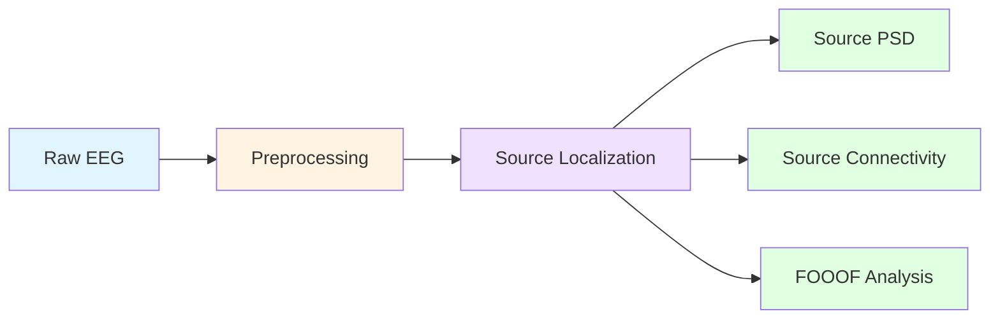

# Complete Source Analysis Pipeline Examples

These examples demonstrate end-to-end source analysis workflows that combine multiple processing blocks to extract comprehensive insights from EEG data.

## Examples

### SourceAnalysisPipeline.py
**Purpose**: Full source analysis pipeline testing all major source analysis blocks

**What it demonstrates**:
- Complete preprocessing pipeline (resample, filter, rereference)
- Source localization (MNE inverse solution)
- Regional power spectral density (source_psd)
- Functional connectivity with graph metrics (source_connectivity)
- Integration of multiple analysis blocks in sequence

**Pipeline Flow**:
```
Raw EEG → Preprocessing → Source Localization → PSD Analysis → Connectivity Analysis
```

**Output files**:
- `derivatives/source_localization/*.h5` - Source estimates (STCs)
- `derivatives/source_psd/*.parquet` - Regional power spectral density
- `derivatives/source_psd/*.csv` - Human-readable PSD data
- `derivatives/source_psd/*_psd_heatmap.png` - PSD visualization
- `derivatives/source_connectivity/*.parquet` - Connectivity matrices
- `derivatives/source_connectivity/*.npy` - NumPy connectivity arrays
- `derivatives/source_connectivity/*_connectivity.png` - Network visualization
- `derivatives/source_connectivity/*_graph_metrics.csv` - Graph theory metrics

**Use case**: When you want to perform comprehensive source-level analysis in a single processing run.

---

## Pipeline Architecture

### Block Dependencies

The source analysis pipeline follows a strict dependency chain:



**Key Insight**: Source localization creates `self.stc` (SourceEstimate object) that downstream blocks consume. All analysis blocks require source localization to run first.

### Data Flow

1. **Preprocessing Stage**:
   - Input: Raw sensor-space EEG (64-129 channels)
   - Operations: Resample, filter, clean channels, rereference
   - Output: Cleaned Raw object

2. **Source Localization Stage**:
   - Input: Preprocessed Raw object
   - Operations: Forward model, inverse solution
   - Output: SourceEstimate object (`self.stc`) with 20,484 vertices

3. **Analysis Stage**:
   - Input: SourceEstimate object
   - Operations: PSD computation, connectivity estimation, spectral parameterization
   - Output: Analysis results in BIDS derivatives

## Configuration Strategy

### Key Design Decisions

#### 1. STC File Saving (Default: OFF)
```python
"apply_source_localization": {
    "enabled": True,
    "value": {
        "save_stc": False,  # STC files are huge (2.3GB for Raw)
        "convert_to_eeg": False  # Not needed for analysis blocks
    }
}
```

**Rationale**: Analysis blocks work directly with `self.stc` in memory. Only save STC files if you need them for external tools.

#### 2. Segment Duration for PSD
```python
"apply_source_psd": {
    "enabled": True,
    "value": {
        "segment_duration": 60,  # Use all available data
        "n_jobs": 4,
        "generate_plots": True
    }
}
```

**Rationale**: Longer segments = better frequency resolution. For 60s of data, use `segment_duration: 60` to avoid edge effects from segmentation.

#### 3. Connectivity Epochs
```python
"apply_source_connectivity": {
    "enabled": True,
    "value": {
        "epoch_length": 4.0,  # Balance resolution and stability
        "n_epochs": 40,       # Average across epochs
        "n_jobs": 4
    }
}
```

**Rationale**:
- 4-second epochs = good frequency resolution (0.25 Hz)
- 40 epochs = stable connectivity estimates
- Total data needed: 160 seconds minimum

## Computational Considerations

### Processing Time Estimates
| Block | Time (60s data) | Time (300s data) |
|-------|----------------|------------------|
| Preprocessing | 10-20 sec | 30-60 sec |
| Source Localization | 2-3 min | 3-5 min |
| Source PSD | 1-2 min | 3-5 min |
| Source Connectivity | 3-5 min | 10-15 min |
| **Total Pipeline** | **6-10 min** | **16-25 min** |

### Memory Requirements
- **Minimum**: 8 GB RAM
- **Recommended**: 16 GB RAM (for parallel processing)
- **Peak usage**: ~4 GB per subject (without saving STCs)

### Parallelization
```python
# Adjust n_jobs based on your system
"n_jobs": 4  # Conservative (4 cores)
"n_jobs": 8  # Moderate (8 cores)
"n_jobs": 10  # Aggressive (10+ cores)
```

**Note**: More jobs = faster but higher memory usage. Monitor your system resources.

## Customizing the Pipeline

### Common Modifications

#### 1. Add ICA for Artifact Removal
```python
"ICA": {
    "enabled": True,
    "value": {"method": "infomax"}
},
"component_rejection": {
    "enabled": True,
    "method": "iclabel",
    "value": {
        "ic_flags_to_reject": ["muscle", "heart", "eog"],
        "ic_rejection_threshold": 0.3
    }
}
```

#### 2. Add FOOOF Analysis
```python
def run(self):
    # ... existing pipeline ...
    self.apply_source_localization()
    self.apply_source_psd()
    self.apply_source_connectivity()

    # Add FOOOF analysis
    self.apply_fooof_aperiodic()
    self.apply_fooof_periodic()
```

#### 3. Focus on Specific Brain Regions
```python
"apply_source_psd": {
    "enabled": True,
    "value": {
        "roi_selection": ["superiorfrontal", "precuneus", "inferiorparietal"],
        "segment_duration": 60,
        "n_jobs": 4
    }
}
```

#### 4. Adjust Connectivity Metrics
```python
"apply_source_connectivity": {
    "enabled": True,
    "value": {
        "methods": ["pli", "wpli", "coh"],  # Multiple metrics
        "freq_bands": {
            "delta": (1, 4),
            "theta": (4, 8),
            "alpha": (8, 13)
        },
        "epoch_length": 4.0,
        "n_epochs": 40
    }
}
```

## Downstream Analysis

### Using Pipeline Outputs

#### 1. Regional PSD Analysis
```python
import pandas as pd

# Load PSD results
psd = pd.read_parquet("derivatives/source_psd/sub-001_psd.parquet")

# Compare power across frequency bands
alpha_power = psd[psd['frequency'].between(8, 13)].groupby('region')['power'].mean()
print(alpha_power.sort_values(ascending=False))
```

#### 2. Network Analysis
```python
import numpy as np
import pandas as pd

# Load connectivity matrix
conn = np.load("derivatives/source_connectivity/sub-001_connectivity.npy")

# Load graph metrics
metrics = pd.read_csv("derivatives/source_connectivity/sub-001_graph_metrics.csv")

# Find hub regions (high betweenness centrality)
hubs = metrics.nsmallest(10, 'betweenness')
print(hubs[['region', 'betweenness', 'clustering']])
```

#### 3. Cross-Subject Analysis
```python
import pandas as pd
from pathlib import Path

# Aggregate PSD across subjects
psd_files = Path("derivatives/source_psd").glob("*_psd.parquet")
df_list = [pd.read_parquet(f) for f in psd_files]
all_psd = pd.concat(df_list)

# Group analysis
mean_psd = all_psd.groupby(['region', 'frequency'])['power'].mean()
```

## Validation and Quality Control

### Expected Outputs Checklist
- [ ] Source localization STCs created (visible in logs)
- [ ] PSD parquet files saved
- [ ] PSD heatmap PNG generated
- [ ] Connectivity matrix NPY saved
- [ ] Graph metrics CSV saved
- [ ] Connectivity visualization PNG created

### Common Issues and Solutions

**Issue**: "Connectivity requires continuous data"
- **Cause**: Epoching enabled before source localization
- **Solution**: Set `epoch_settings.enabled: False`

**Issue**: "Not enough data for connectivity"
- **Cause**: Data duration < `epoch_length × n_epochs`
- **Solution**: Adjust `n_epochs` or remove `crop_step`

**Issue**: "Memory error during processing"
- **Cause**: Too many parallel jobs
- **Solution**: Reduce `n_jobs` parameter in blocks

**Issue**: "Forward solution computation failed"
- **Cause**: Missing or invalid montage
- **Solution**: Verify `montage` setting matches your EEG cap

## Scientific Applications

### Research Questions Suited for This Pipeline:
- ✅ Resting-state network organization
- ✅ Regional spectral power differences across groups
- ✅ Hub identification in brain networks
- ✅ Frequency-specific connectivity patterns
- ✅ Source-level biomarker discovery

### Example Publications Using Similar Pipelines:
- Resting-state EEG connectivity in Alzheimer's disease
- Developmental changes in cortical oscillations
- Network disruptions in epilepsy
- Effects of brain stimulation on connectivity
- Neurofeedback target identification

## Running the Examples

```bash
# Full source analysis pipeline
autocleaneeg-pipeline process --task SourceAnalysisPipeline --file /path/to/data.set

# Monitor progress
tail -f ~/.autoclean/logs/pipeline.log

# Check outputs after completion
ls derivatives/source_*/
```

## Performance Optimization Tips

1. **Use longer recordings**: More data = more stable connectivity estimates
2. **Adjust segment/epoch parameters**: Balance frequency resolution vs. variance
3. **Selective region analysis**: Focus on ROIs of interest to reduce computation
4. **Batch processing**: Process multiple subjects in parallel on HPC clusters
5. **STC caching**: Keep STCs in memory between blocks (don't save/reload)

## References

- **Minimum Norm Estimation**: Hämäläinen MS & Ilmoniemi RJ (1994). *Med Biol Eng Comput*, 32(1), 35-42.
- **MNE-Python**: Gramfort A, et al. (2013). *Front Neurosci*, 7, 267.
- **Graph Theory in Neuroscience**: Rubinov M & Sporns O (2010). *NeuroImage*, 52(3), 1059-1069.
- **Phase-Lag Index**: Stam CJ, et al. (2007). *Hum Brain Mapp*, 28(11), 1178-1193.
- **Desikan-Killiany Atlas**: Desikan RS, et al. (2006). *NeuroImage*, 31(3), 968-980.